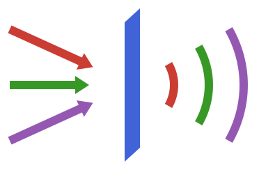

```@meta
CurrentModule = OpticsBase
```

# OpticsBase.jl

```@raw html

```

```@docs
OpticsBase
```

## A chain of solvers

Every solver package offers methods that return a [`PlaneField`](@ref) and methods that
take one. A chain is plain function composition:

```julia
using BeamletOptics, BeamletFibers, OpticsBase

f1 = PlaneField(detector; size = (256, 256), spacing = (0.25e-6, 0.25e-6))  # beamlets → field
f2, stats = propagate(f1, fiber, FDBPM(dz = 1e-6); grid)                   # BPM through a fiber
src = WavefrontBeamletDecomposition(f2)                                     # field → beamlets
```

There is no solver interface to implement, no traits and no converter registry. A new
solver package only needs to read and write the fields of `PlaneField` according to the
[Conventions](@ref).

## Reference

```@docs
PlaneField
VACUUM_IMPEDANCE
coordinates
reference_phase
power
forward
backward
```
